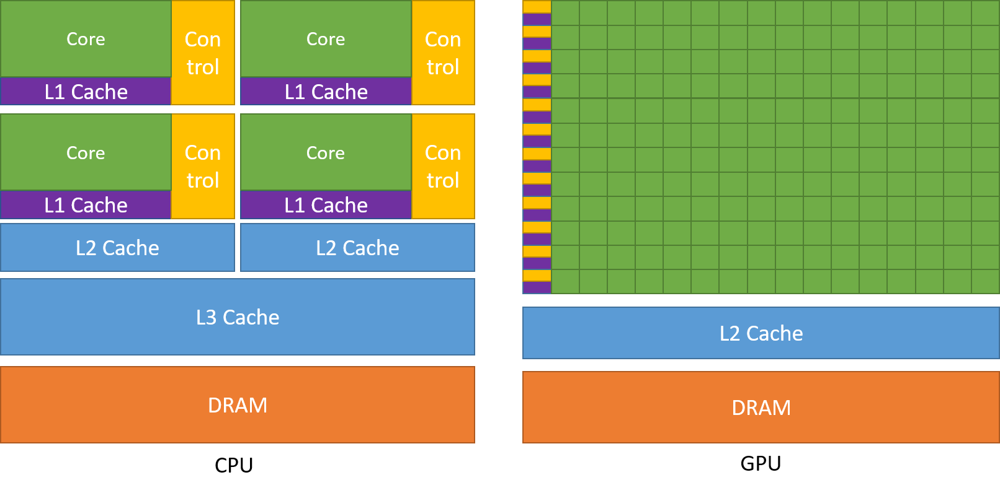

# CPU vs GPU vs TPU

#### CPU:

**Цель**: вычисления общего назначения

* Кол-во ядер: ~128
* Мощность ядер: 3.5 GHz

#### GPU:

**Цель**: узкоспециализированные вычисления, с большой степенью **распараллеливания**

* Кол-во ядер: ~7k
* Мощность ядер: ~1 GHz

#### Полезные материалы:

* [YouTube видео](https://www.youtube.com/watch?v=Axd50ew4pco), в котором объясняется разница
* [WebGPU Puzzles](https://gpupuzzles.answer.ai/intro)

TODO
https://www.youtube.com/watch?v=GKQz4-esU5M

TODO TPUs
