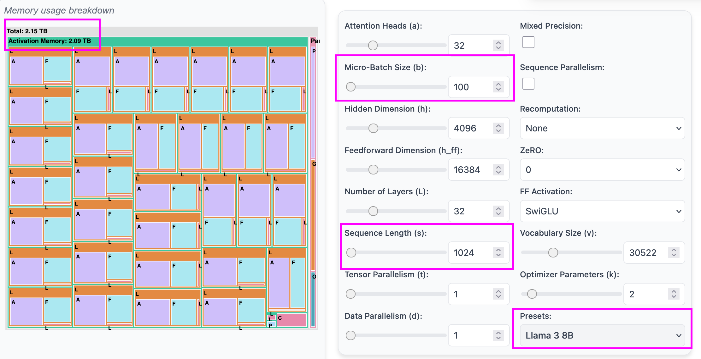
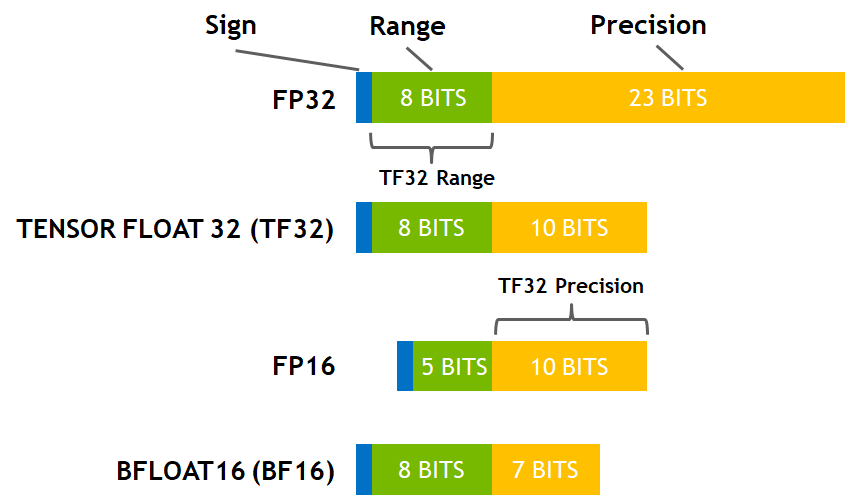
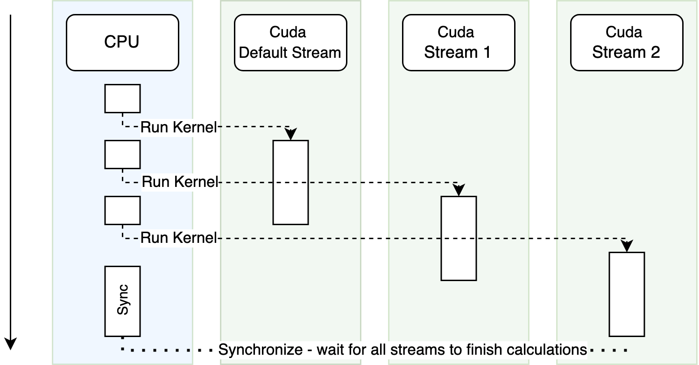
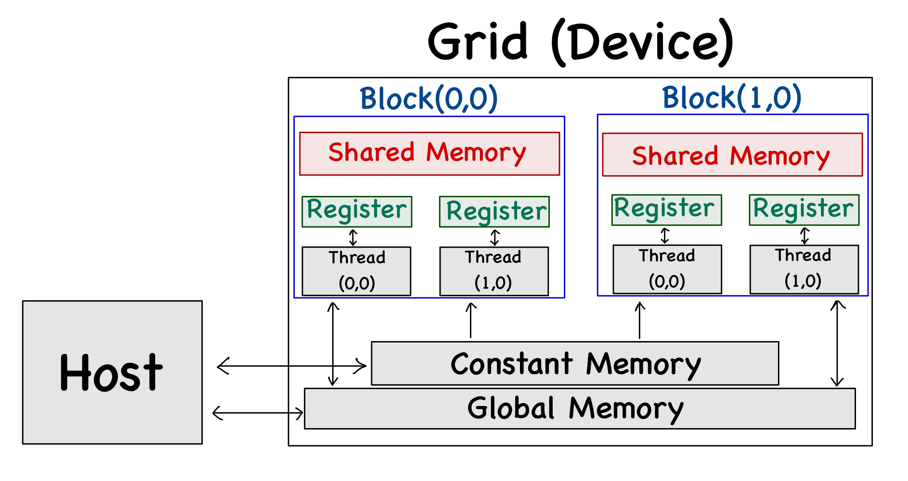

<style>
    .reveal .slides {
        text-align: left;
    }

    .reveal table {
        font-size: 30px;
    }

</style>


## ⚡️ Efficiency

## 🎯 **Goals**

<!-- * Understand different number formats and their trade-offs.
* Gain hands-on experience optimizing model training for speed and resource use.
* Learn to profile, analyze, and improve model implementation and data pipelines. -->

---

## ⚠️ Problems

* **GPU Memory**
* **Training Speed** (Compute/Memory/Disk bottlenecks)

---

## 💾 **GPU Memory**

* Good GPU memory size for NN training: **80GB**
* **Llama3.1 8B:** **1M** tokens is a good batch size
* 100M Batch size requires **2TB** GPU memory *(naive training realization)* 🤔



---

## ⏳ **Training Speed**

### 💰 **1 GPU-hour = $2**


| Model | GPU-Hours |
|-------|-----------|
| Llama3.1 8B | 1.46M    |
| Llama3.1 70B | 7.0M    |
| Llama3.1 405B | 30.84M |


---

## 1️⃣ Single-GPU Training


| Feature | Training speed | Memory usage |
|---|---|---|
| batch size | ✅ | ✅ |
| gradient accumulation | ❌ | ✅ |
| gradient checkpointing | ❌ | ✅ |
| mixed precision | ✅ | ❌✅ |
| optimizers | ✅ | ✅ |
| data preloading | ✅ | ❌ |
| torch_empty_cache_steps | ❌ | ✅ |
| torch.compile | ✅ | ❌ |
| PEFT | ❌ | ✅ |
| Efficient kernels| ✅ | ✅ |

</br>

### 📚 **Resources**:

* [**HF GPU Perf Guide**](https://huggingface.co/docs/transformers/en/perf_train_gpu_one)


---

## Batch size

* Why does it matter❓ Why large batch size saves computations❓

---

## Batch size

* Why does it matter❓ Why large batch size saves computations❓
    * 💡 GPUs are optimized for high parallelization.
    * 💡 Large batch size allows for more parallelization.
    * 💡 Small batch size requires more iterations to converge.
    * 💡 Sometimes Model Params are larger then processed data. Model params loading makes task **💾 Memory-bound** not **🧮 Compute-bound**.

---

## 🔋 Gradient Accumulation

**Idea:** Split batch into smaller chunks and accumulate gradients.


```python
for i, batch in enumerate(dataloader):
    loss = model(batch)
    loss.backward()
    if (i + 1) % accumulation_steps == 0:
        optimizer.step()
        optimizer.zero_grad()
```

---

## 🔋 Gradient Accumulation

**Idea:** Split batch into smaller chunks and accumulate gradients.

**HF Trainer:**
```python
training_args = TrainingArguments(
    ...
    gradient_accumulation_steps=4,
)
```


---

## 📸 Gradient Checkpointing

**Idea:** Save memory by checkpointing intermediate activations and recomputing them at backward pass.

```python
training_args = TrainingArguments(
    ...
    gradient_checkpointing=True,
)
```

<br/>

❓ Why do we need to save and even recompute activations at backward pass?

---

## 🍸 Mixed Precision

**Idea:** Use lower precision for some model modules to speed up training.

[**torch.amp**](https://docs.pytorch.org/docs/stable/amp.html)
```python
with torch.autocast(device_type="cuda", dtype=torch.float16):
    loss = model(batch)
    ...
```
</br>

#### **HF Trainer:**
**fp16** / **bf16**
```python
training_args = TrainingArguments(
    ...
    fp16=True,
    # bf16=True,
)
```

---

### 🍸 Automatic Mixed Precision

[**torch.amp**](https://docs.pytorch.org/docs/stable/amp.html)


**CUDA Ops that can autocast to float16**
```
__matmul__, addbmm, addmm, addmv, addr,baddbmm, bmm, chain_matmul,
multi_dot, conv1d, conv2d, conv3d, conv_transpose1d,
conv_transpose2d, conv_transpose3d, linear,
matmul, mm, mv,
... and more
```

<br/>

**CUDA Ops that can autocast to float32**
```
__pow__, __rdiv__, __rpow__, __rtruediv__,
acos, asin, cosh,
binary_cross_entropy_with_logits, cosine_embedding_loss,
log, log_softmax, log10, log1p, log2,
mse_loss, multilabel_margin_loss, multi_margin_loss, l1_loss, nll_loss,
norm, normalize,
... and more
```

---

## 🍸 Mixed Precision

* `float32` vs `float16` vs `bfloat16` vs `int8`
* Trade-offs: Precision, speed



---

## 🍸 Mixed Precision

<br/>

❗️ **Note:**
* [bfloat16 issues](https://github.com/huggingface/transformers/issues/25420#issuecomment-1775317535) - **bf16** works worse than **fp16** for Llama3.1 models


---

## 🍸 Mixed Precision

### Task 🤔

> There is a set of floating-point numbers. We need to calculate the sum of these values.

### Naive approach

```python
sum = 0
for value in values:
    sum += value
```

### Any Problems❓

---

## 🍸 Mixed Precision

### Task 🤔

### Sort Values

```python
sum = 0
for value in sorted(values):
    sum += value
```

---

## 🍸 Mixed Precision

### Task 🤔

### Maintain Sorted Order

```python
import bisect

sum_keep_sorted_optim = 0
sorted_floats_optim = float_array.tolist()
for _ in tqdm(range(len(sorted_floats_optim) - 1)):
    sum_least_elements = sorted_floats_optim.pop(0) + sorted_floats_optim.pop(0)
    bisect.insort_left(sorted_floats_optim, sum_least_elements)
    if len(sorted_floats_optim) == 1:
        sum_keep_sorted_optim = sorted_floats_optim[0]
```

---

## 📈 Optimizers

<br/>

* Adafactor - memory efficient optimizer
* 8-bit Adam - Keeps Quantized Weights in memory

---

## 📦 DataLoaders

<br/>

* `num_workers`
    * Disk IO bottlenecks
* `prefetch_factor`
* `Data collators`
* Dataset caching and lazy loading
* Memory pinning

---

## ∅torch_empty_cache_steps

<br/>

* 💾 Saves memory by clearing CUDA cache
* ❗️ Slows down training (up to 2x)
* Why it slows down❓

```
training_args = TrainingArguments(
    ...
    torch_empty_cache_steps=4,
)
```

---

## ⚒️ torch.compile

<br/>

**JIT** - Just-In-Time compilation

**How it works:**
* 💡 Python-level tracing mechanism (TorchDynamo).
* 💡 Compiles captured operations to **fused CUDA kernels**
* 💡 Caches compiled graphs
* 💡 Reuses compiled graphs
    * If input shapes/types are the same


---

## ⚒️ torch.compile

<br/>

**Pros:**
* ✅ Reduces GPU memory usage (why❓)
* ✅ Speeds up training

**Cons:**
* ❗️ Graph compilation - first steps could be slow
* ❗️ Graph recomputation if input shape changes

---

## ⚒️ torch.compile

<br/>

**[torch.compile](https://docs.pytorch.org/tutorials/intermediate/torch_compile_tutorial.html)**
```python
model = torch.compile(model)
```

**HF Trainer:**
```python
training_args = TrainingArguments(
    ...
    torch_compile=True,
)
```

---

## ⚒️ torch.compile

<br/>

### Resources:

* [Look Ma, No Bubbles](https://t.me/quant_prune_distill/489) - single-kernel GPT
* [torch.compile docs](https://docs.pytorch.org/tutorials/intermediate/torch_compile_tutorial.html)


---

## 🔖 PEFT

<br/>

* [Soft Prompts](https://huggingface.co/docs/peft/conceptual_guides/prompting)
* [LoRA](https://huggingface.co/docs/peft/conceptual_guides/adapter)


---

## 🔖 [PEFT: Soft Prompts](https://huggingface.co/docs/peft/conceptual_guides/prompting)

<br/>

| Feature                         | Prompt Tuning         | Prefix Tuning               | P-Tuning                             |
| ------------------------------- | --------------------- | --------------------------- | -------------------------------------- |
| Affects All Transformer Layers? | ❌ No                  | ✅ Yes                       | ✅ Yes                                  |
| Learnable parameters type       | Soft token embeddings | MLP over soft embeddings | MLP/LSTM overt Soft Tokens             |

---

## 🔖 [PEFT: Soft Prompts](https://huggingface.co/docs/peft/conceptual_guides/prompting)

<br/>

* What is the difference between Soft Prompt and Hard Prompt❓
* Why do we need MLP or LSTM over Soft Tokens❓

---

## 🔖 [PEFT: LoRA](https://huggingface.co/docs/peft/conceptual_guides/adapter)

<br/>

**Idea:**
* Add trainable shift for MLPs output
* Trainable params should be small


---

## 🛑 Implementation Efficiency

<br/>

> The first rule of optimization: **<span style="color:red;">Don't do it</span>**


---

## 🛑 Implementation Efficiency

<br/>

> The first rule of optimization: **<span style="color:red;">Don't do it</span>**

<br/>

* Are you sure your task was never solved before❓

---

## 🛑 Implementation Efficiency

<br/>

Low-level optimizations checklist:

* ✅ Write dummy PyTorch implementation
* ✅ Use `torch.compile`
* ✅ Ask ChatGPT to optimize it
* 🛑 Use Triton
* 🛑 Use C++/CUDA

---

## 🛑 Implementation Efficiency

<br/>

Still think you need to write C++/CUDA code❓

---

## 🛑 Implementation Efficiency

<br/>


---

## 🛑 Implementation Efficiency

<br/>

### Topics:

* CUDA Async Nature
* CUDA Architecture
* CUDA Memory Hierarchy
* CUDA Kernel Life Cycle
* CUDA Kernel fusion
* CUDA kernels with Triton
* CUDA kernels with C++/CUDA

---

## Cuda Async Nature



<br/>

**Resources:**
* [Asynchronous Execution (Torch Docs)](https://docs.pytorch.org/docs/stable/notes/cuda.html#asynchronous-execution)

---

## Cuda Async Nature

❗️ This code measures only CPU time for kernel launch
```python
start_time = time.time()
module.forward(x)
end_time = time.time()
print(f"Time taken: {end_time - start_time} seconds")

```

---

## Cuda Async Nature

❗️ use `torch.cuda.synchronize()`
```python
start_time = time.time()
module.forward(x)
torch.cuda.synchronize() # ❗️NEW LINE❗️
end_time = time.time()
print(f"Time taken: {end_time - start_time} seconds")

```

---

## Cuda Async Nature

<br/>

* When do we need to run async streams❓
* Could we benefit from async streams in case of parallel compute-bound tasks that utilizes all GPU cores❓

---

## CUDA Architecture

<br/>

* Grid > Block > Thread




---

## CUDA Architecture


<br/>


| Level      | What It Is           | Can Communicate?            |
| ---------- | -------------------- | --------------------------- |
| **Thread** | Basic execution unit | With other threads in block |
| **Block**  | Group of threads     | Within the block only       |
| **Grid**   | Group of blocks      | No direct communication     |

**Resources:**
* [**CUDA Programming Guide**](https://docs.nvidia.com/cuda/cuda-c-programming-guide/)
* [**GPU Compute and Memory Architecture**](https://0mean1sigma.com/chapter-3-gpu-compute-and-memory-architecture/)

---

## CUDA Memory Hierarchy

<br/>

* Off-chip memory
* On-chip memory


---

## CUDA Memory Hierarchy

### Off-chip memory

| Memory Type         | Size | Latency / Bandwidth         | Notes                                                      |
| ------------------- | ---- | ------------------------------- | --------------------------- | ---------------------------------------------------------- |
| **Global Memory**   | \~80 GB    | High latency, low bandwidth | Main memory for large data; read/write by all              |
| **Local Memory**    | Per-thread | High latency                | Private memory space for a thread; stored in global memory |
| **Constant Memory** | \~64 KB  | Low latency, high bandwidth | Read-only on GPU, optimized via cache                      |


---

## CUDA Memory Hierarchy

### On-chip memory

| Memory Type       | Size (typical) | Latency / Bandwidth         | Notes                                           |
| ----------------- | ----------------------- | --------------------------- | ----------------------------------------------- |
| **Shared Memory** | \~16 KB / SM   | Low latency, high bandwidth | Enables inter-thread communication in a block   |
| **Registers**     | \~8 KB / SM   | Very low latency            | Fastest memory; used for thread-local variables |

---

## CUDA Memory Hierarchy

<br/>

* How should we use this knowledge❓
* Is there any parallels with CPU memory hierarchy❓

---

## CUDA Memory Hierarchy

### Outlines

* **Off-chip memory** → larger but slower.
* **On-chip memory** → faster but very limited.
* **Shared memory** allows collaboration within a block, while **global memory** is accessible across blocks.


---

## CUDA Kernel Life Cycle

<br/>

| Stage                     | Where it Happens | Output Format  |
| ------------------------- | ---------------- | -------------- |
| Writing Kernel Code       | Developer (CPU)  | `.cu` file     |
| Compiling                 | CPU              | Host obj + PTX |
| Loading                   | CPU → GPU        | PTX/SASS       |
| Execution                 | GPU              | Running kernel |
| Data Handling             | CPU ↔ GPU        | Raw memory     |


---

## CUDA Kernel Fusion

<br/>

What is kernel fusion❓
<br/>
<br/>

**Original:**
```c
__global__ void kernelA(...) {  }
__global__ void kernelB(...) { ... }
```

**Fused:**
```c
__global__ void fusedKernel(...) {
    // do A's work
    // do B's work
}
```


---

## CUDA Kernel Fusion

<br/>

| Benefit                      | Explanation                            |
| ---------------------------- | -------------------------------------- |
| Less kernel launch overhead  | Reduces CPU-GPU sync and setup time    |
| Better memory locality       | Intermediate data kept in fast memory  |
| Less global memory traffic   | Avoids slow reads/writes to DRAM       |

---

## 😢 Out of scope:

* **Extreme low-bit quantization**
    * [**AWQ**](https://huggingface.co/docs/transformers/main/quantization/awq)
    * [**Quantization-aware training**](https://pytorch.org/blog/quantization-aware-training/)

<br/>
<br/>

* **Distributed training**
    * [**HF Distributed Training**](https://huggingface.co/docs/optimum/intel/neural_compressor/distributed_training)
    * [**HF Perf Training Many GPUs**](https://huggingface.co/docs/transformers/main/en/perf_train_gpu_many)
    * [**Ultrascale Playbook**](https://huggingface.co/spaces/nanotron/ultrascale-playbook)

<br/>
<br/>

* **Pytorch internals**
    * [**Pytorch Internals**](http://blog.ezyang.com/2019/05/pytorch-internals/)
    * [**A Tour of Pytorch Internals**](https://pytorch.org/blog/a-tour-of-pytorch-internals-1/)


