

## Image Understanding (recap)

* ViT
* CLIP
* ImageBind

---

## [Vision Transformer (2021)](https://arxiv.org/pdf/2010.11929)

* Patchify Image
* Patch Linear Projection
* Image Classification

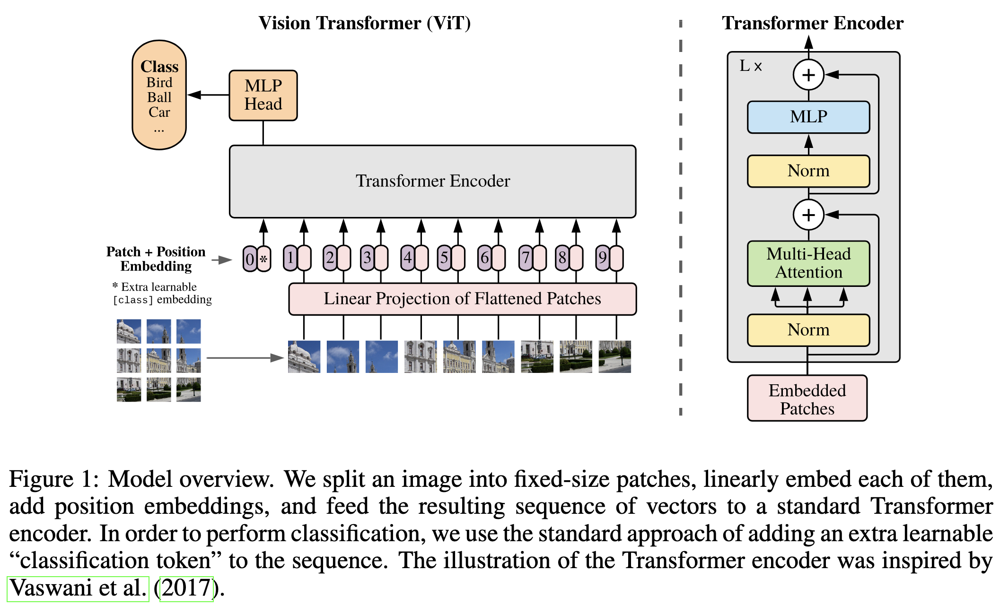

---

## [CLIP (2021)](https://arxiv.org/pdf/2103.00020)

* ViT Image Encoder
* Text Transformer
* One vector for each image and text
* Text-Image Contrastive Loss

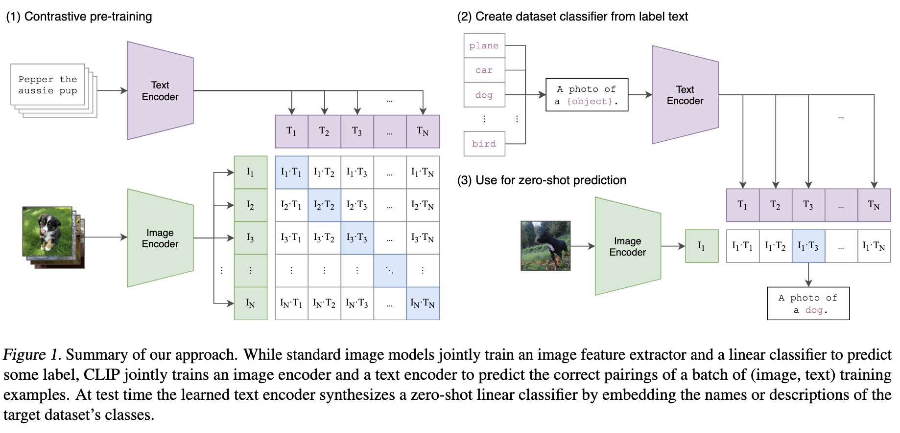

---

## [CLIP (2021)](https://arxiv.org/pdf/2103.00020)

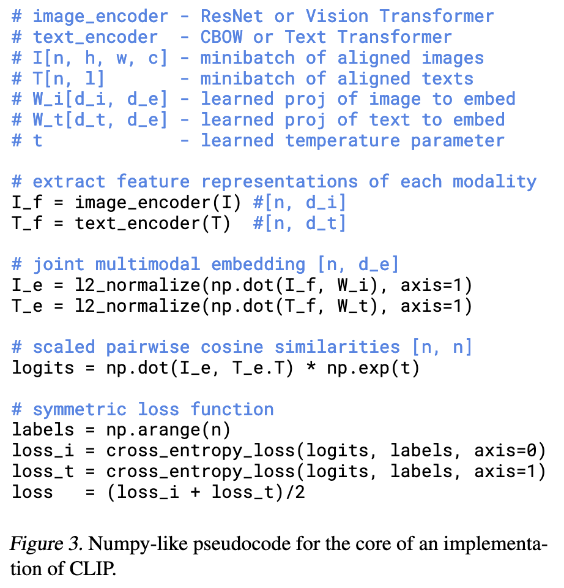

---

## [ImageBind (2023)](https://arxiv.org/pdf/2305.05665)

* Mostly same as CLIP
* More modalities supported

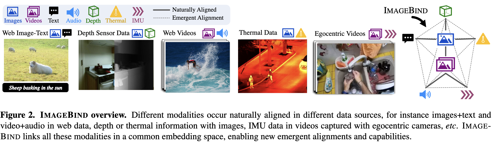

---

## Comparison

| Feature                | **Vision Transformer (ViT)** | **CLIP**         | **ImageBind**          |
| ---------------------- | ---------------------------- | ---------------------- | ---------------------- |
| **Training Objective** | Classification               | Image–text contrastive | Multimodal contrastive |
| **Text Modality**      | ❌                            | ✅                      | ✅                      |
| **Image Modality**     | ✅                            | ✅                      | ✅                      |
| **Audio Modality**     | ❌                            | ❌                      | ✅                      |

---

## Image Understanding (recap)

* ✅ ViT
* ✅ CLIP
* ✅ ImageBind

---

## Image Understanding

### Questions

* What advantages does the transformer architecture bring to image processing compared to CNNs❓
* How does CLIP's ability to learn from natural language supervision make it more flexible than traditional image classification models❓
* What is shared embedding space for different modalities❓

---

## Image Generation (not LLM-based)

* Dalle
* Dalle2
* VAR

---

## [Dalle (2021)](https://arxiv.org/abs/2102.12092)

* Compress Image to Discrete Latent Space
* Transformer Causal Modeling Of Text and Images

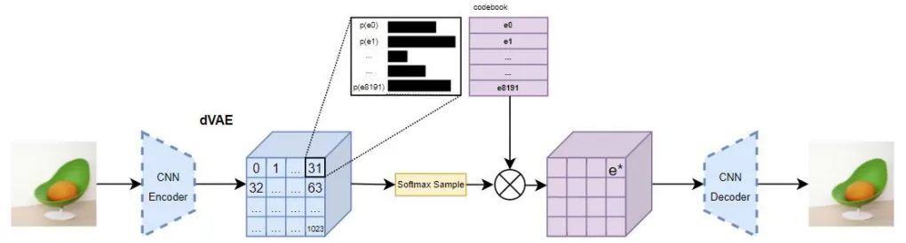

---

## [Dalle (2021)](https://arxiv.org/abs/2102.12092)

* Compress Image to Discrete Latent Space
* Transformer Causal Modeling Of Text and Images

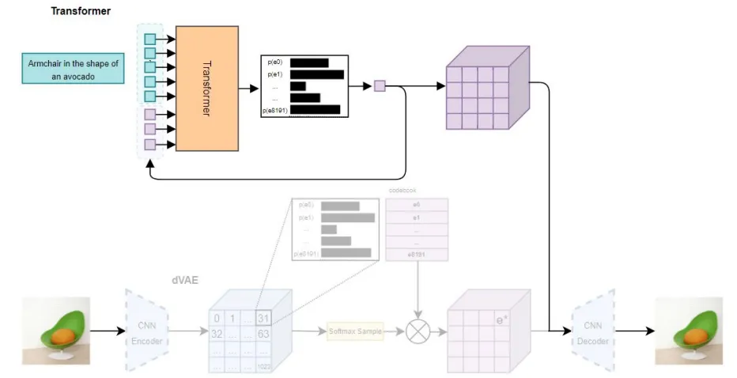

---

## [Dalle2 (2022)](https://arxiv.org/pdf/2204.06125)

* Pretrained CLIP (Joint Embedding Space)
* Prior Model for Text to Image embedding Transfer
* Diffusion Decoder
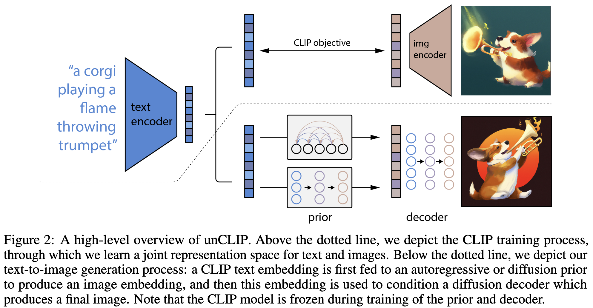

---

## [VAR (2024)](https://arxiv.org/pdf/2404.02905)

* Visual Autoregressive Modeling via Next-Scale Prediction
* VQVAE for Image Compression

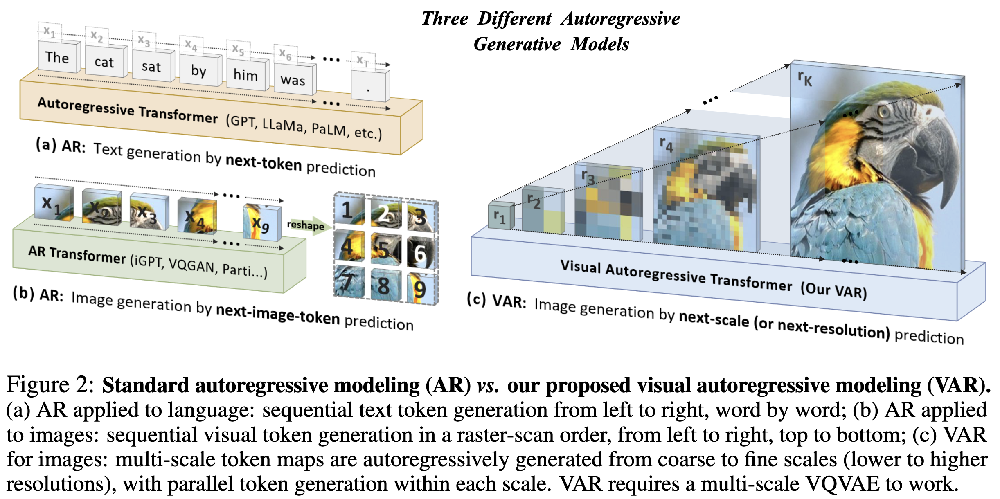

---

## Image Generation

* ✅ Dalle - Autoregressive image generation

* ✅ Dalle2 - Diffusion image generation

* ✅ VAR - Visual Autoregressive Modeling via Next-Scale Prediction

---

## Questions

* Dalle{1,2} differences❓
* How to teach LLMs to generate images❓

---

## LLM-based Approaches

---

## Understanding

* Early Fusion - Inputs Concatenation
* Deep Fusion - Cross Attention

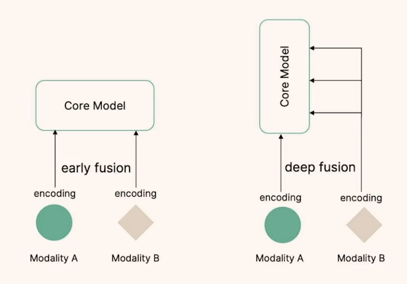

[Image Credit](https://vkvideo.ru/video-210514085_456239093?t=24m46s)

---

### Модели:
* Flamingo
* Formage
* Encodec (2022)
* Llava

---

## [Flamingo (2022)](https://arxiv.org/abs/2204.14198)

* CLIP Image Encoder
* ❗️ Interleaved Data
* ❗️ Deep Fusion

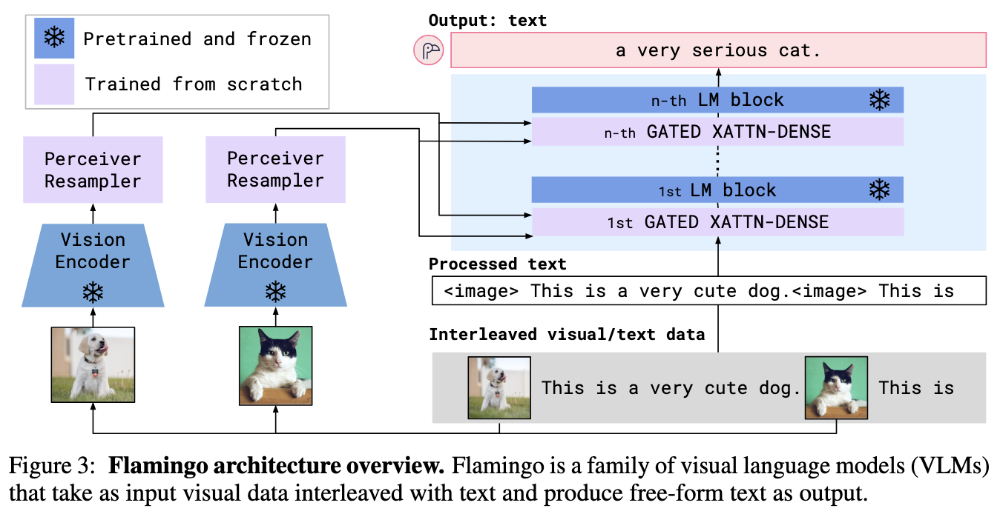

---

## [Flamingo (2022)](https://arxiv.org/abs/2204.14198)

### ❗️ Perceiver Resampler

* Fixed image embeddings size
* Learned Query Vectors

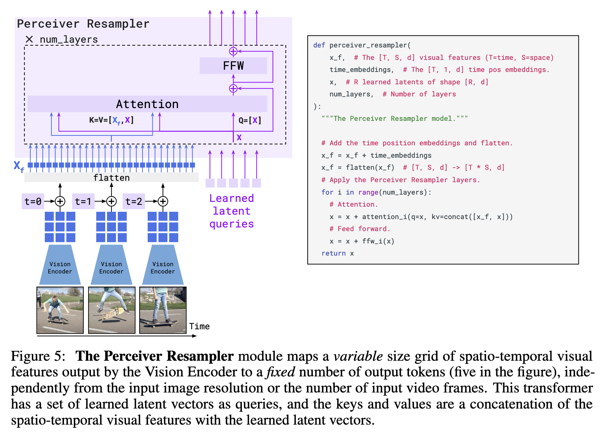

---

## [Fromage (2023)](https://arxiv.org/pdf/2301.13823)

* CLIP Image Encoder
* Opt LLM
* Early Fusion
* ❗️Image Retrieval

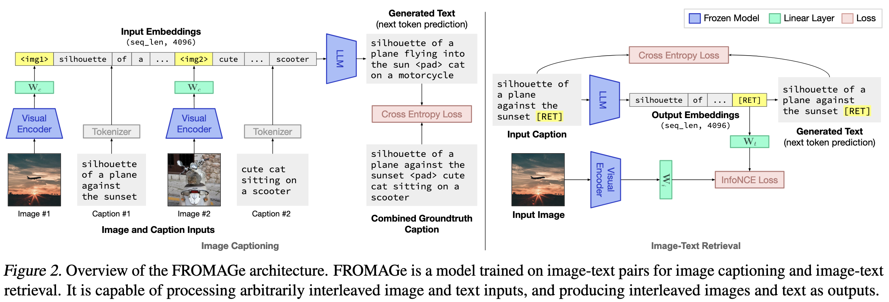

---

## [BLIP2 (2023)](https://arxiv.org/pdf/2301.12597)

* CLIP Image Encoder
* Opt LLM / Flan T5
* Early Fusion
* ❗️QFormer for Image Embedding
* Freezed LLM

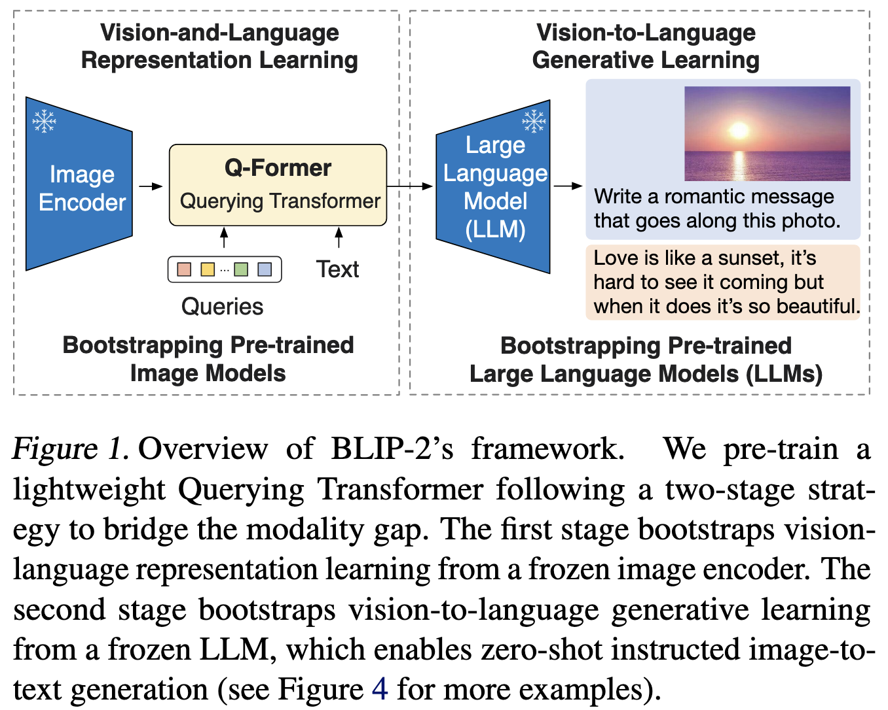

---

## [Llava (2023)](https://arxiv.org/pdf/2304.08485)

* CLIP Image Encoder
* Vicuna-7B LLM
* 2-stage training:
    * Feature Alignment
    * End-to-End SFT

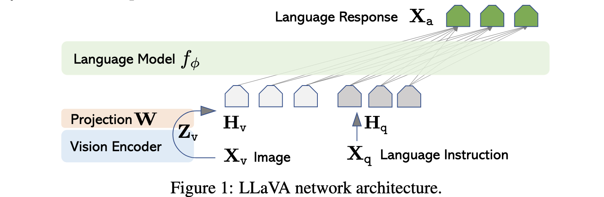

---

## LLM Image Understanding

### Comparison

| Feature / Model        | **Flamingo**       | **Fromage** | **BLIP2** | **LLaVA** |
| ---------------------- | ------------------ | ----------- | --------- | --------- |
| **Fusion Type**        | Deep | Early       | Early     | Early     |
| **Interleaved Data**   | ✅                  | ❌           | ❌         | ❌         |
| **Image Retrieval**    | ❌                  | ✅           | ✅         | ❌         |
| **Instruction Tuning** | ❌                  | ❌           | ✅         | ✅         |

---

## LLM Image Understanding

### Questions

* Why **CLIP** ViT is utilized in most MLLM models❓
* DeepFusion and Encoder-Decoder Transformer Difference❓
* Flamingo Perceiver Resampler vs Blip2 QFormer❓

---

## LLM Image Generation / Editing

* GILL
* Mgie
* Bagel

---

## [GILL (2023)](https://arxiv.org/pdf/2305.17216)

* Image Understanding
* Image Retrieval and Generation
* LLM learns to generate image embeddings for image generation model
* 8 visual tokens

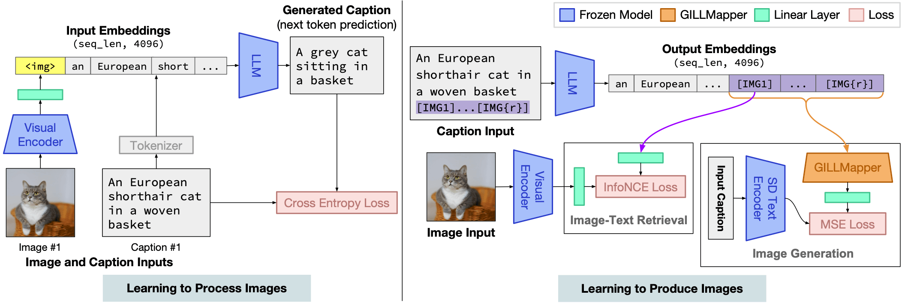

---

## [GILL (2023)](https://arxiv.org/pdf/2305.17216)

* How GillMapper looks like❓

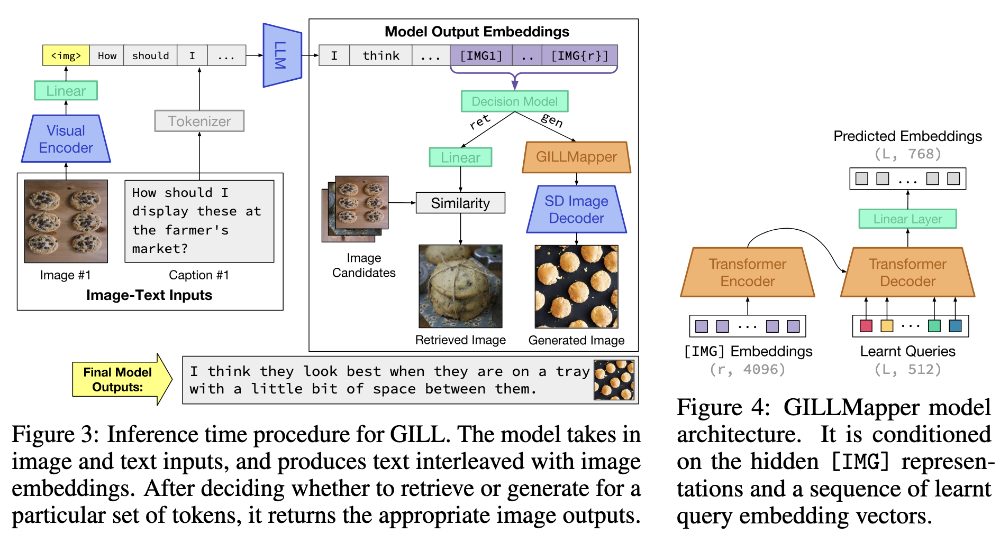

---

## [Mgie (2024) Apple](https://arxiv.org/pdf/2309.17102)

* ❗️ Task: Instruction-based editing
* Expressive Instructions
* Mostly inspired by GILL

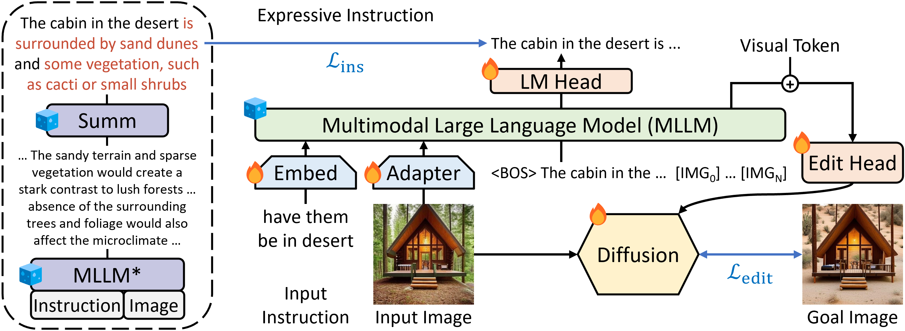

---

## [Bagel (2025) ByteDance](https://arxiv.org/pdf/2505.14683)

* ❗️ Tasks: Understanding, Editing, Style Transfer, ...
* Thinking before Generation
* Data
* Qwen2.5 LLM
* SigLIP2 Image Encoder
* FLUX VAE

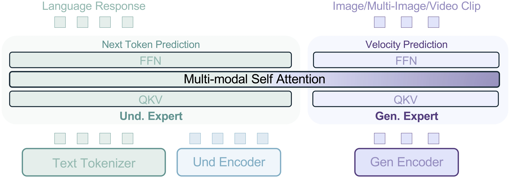

---

## [Bagel (2025) ByteDance](https://arxiv.org/pdf/2505.14683)

### Samples

---

## LLM Image Generation / Editing

* ✅ GILL
* ✅ Mgie
* ✅ Bagel

---

## LLM Image Generation / Editing

### Metrics

* Side-by-side User Study

---

## Materials

* [Елизавета Гончарова | Мультимодальные подходы и LLM](https://vkvideo.ru/playlist/-210514085_1/video-210514085_456239093)
* [Максим Куркин | MLLMs](https://vkvideo.ru/playlist/-210514085_1/video-210514085_456239089)
* [Обзор на русском от Максима мультимодальных подходов](https://github.com/ai-forever/fbc3_aij2023/blob/1f6cff327abe72d409fef8558558d46a7a588c2a/SOTA_SURVEY.md)
* [Molmo](https://github.com/allenai/molmo) - VLLM от allenai с открытым кодом тренировки
* [InternVL-2.5](https://internvl.github.io/blog/2024-12-05-InternVL-2.5/) - SOTA VLLM Image Encoder
* [Malvina](https://habr.com/ru/companies/sberbank/articles/913802/) - как решают задачу pixel-perfect редактирования изображений в команде Gigachat

---

# Audio Modality

---

## Audio Representations

* Waveform
* Mel-Spectrogram

---

## Waveform

* Raw audio samples
* Time series
* Sample rate: 16kHz-48kHz

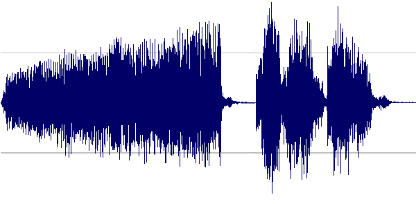

---

## Mel-Spectrogram

* Semantically compressed (but approximately same size in bytes as waveform)
* Windowed Fourier Transform
* Hop size = 10 ms (Time frames)
* Mel bins = 40 to 128 (Frequency bins)

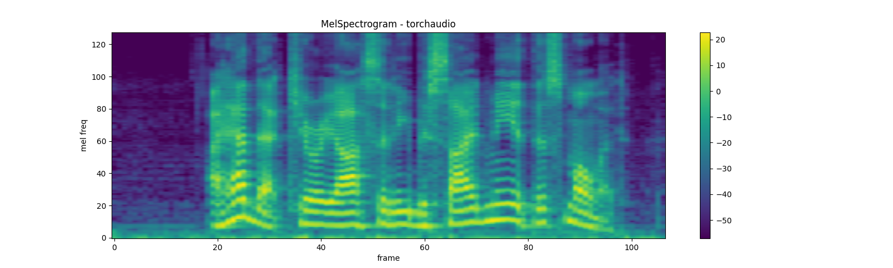

---

## Audio Codecs

🎯 **Goal:**

Discrete Audio Representation for Causal Modeling (and/or audio compression)

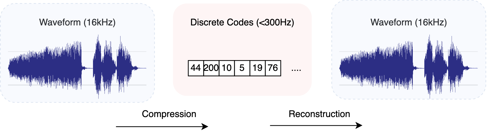

---

## Audio Codecs

🤖 **Models:**
* Encodec (2022)
* Mimi (2024)

---

## [Encodec (2022)](https://arxiv.org/pdf/2210.13438)

### Architecture

* Varying Bitrates (Residual
Vector Quantization)

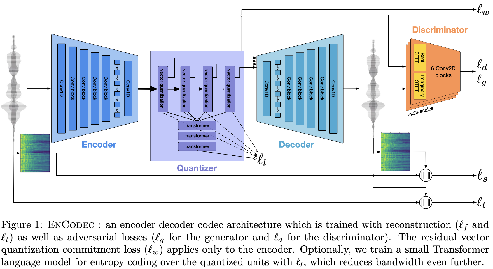

---

## [Encodec (2022)](https://arxiv.org/pdf/2210.13438)

### Loss

Reconstruction loss

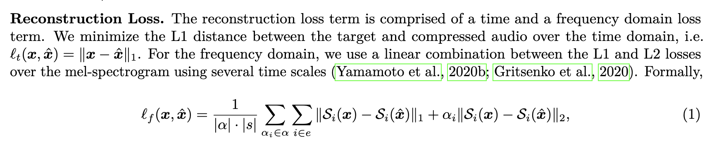

---

## [Encodec (2022)](https://arxiv.org/pdf/2210.13438)

### Loss

Discriminative Loss

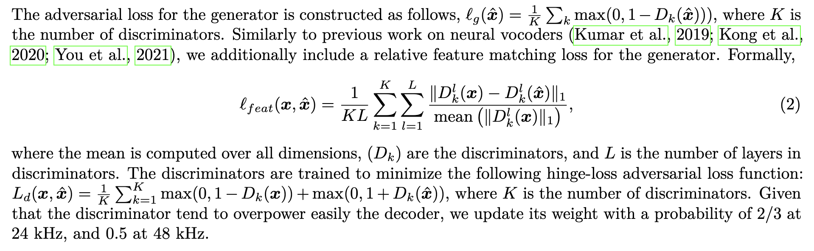

---

## [Encodec (2022)](https://arxiv.org/pdf/2210.13438)

### Loss

RVQ Commitment Loss

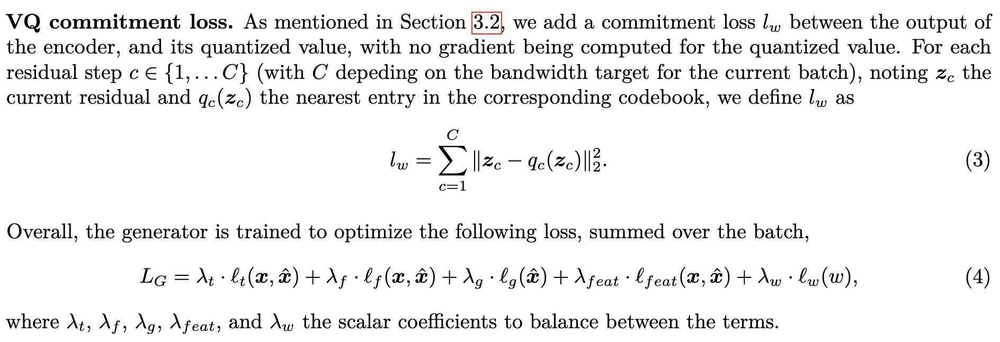

---

## [Encodec (2022)](https://arxiv.org/pdf/2210.13438)

### Loss

Balancer

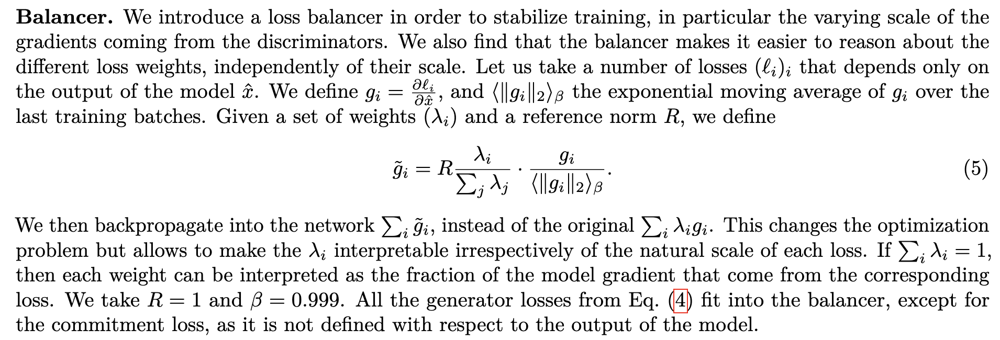

---

## [Encodec (2022)](https://arxiv.org/pdf/2210.13438)

### Evaluation

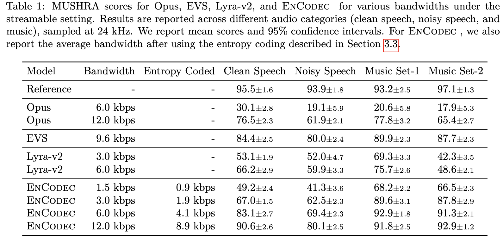

---

## Audio Codecs

🤖 **Models:**
* ✅ Encodec (2022)
* Mimi (2024)

---

## [Mimi (2024)](https://arxiv.org/pdf/2410.00037)

### Architecture

* 🆕 Semantic Features Distillation

---

## [Mimi (2024)](https://arxiv.org/pdf/2410.00037)

### Metrics

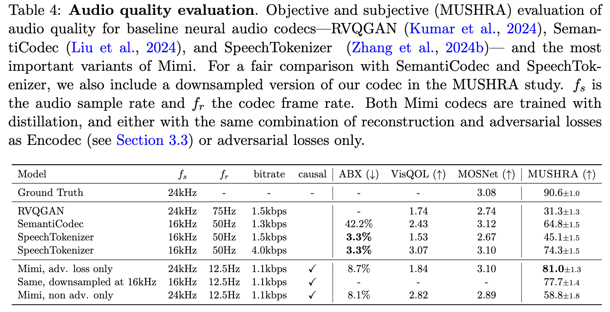

---

## Audio Codecs

* ✅ Encodec
* ✅ Mimi

---

## Audio Codecs

| **Feature**                              | **Mimi**                         | **Encodec** (Meta)               |
| ---------------------------------------- | ----------------------------------------------------- | -------------------------------------------- |
| **Input audio sample rate**  | 16 kHz | 24,48 kHz |
| **Codec sample rate**        | 12.5 Hz | 150-2400 Hz |
| **Varying bandwidth** | ❌ | ✅ |
| **Semantic distillation** | ✅ | ❌ |

---

## Coversational LLMs

☑️ Audio Understanding

☑️ Audio Generation

☑️ Emotional

☑️ Interruptions handling

☑️ Instructions following (world model)

---

## Coversational LLMs

<iframe width="1120" height="630" src="https://www.youtube.com/embed/D9byh4MAsUQ?si=4bYXBCvFWT_c-7LD&amp;start=57" title="YouTube video player" frameborder="0" allow="accelerometer; autoplay; clipboard-write; encrypted-media; gyroscope; picture-in-picture; web-share" referrerpolicy="strict-origin-when-cross-origin" allowfullscreen></iframe>

---

## Audio LLMs

* Qwen2.5-Audio 👈
* Qwen2.5-Omni
* Moshi

---

## [Qwen2.5-Audio.](https://arxiv.org/pdf/2311.07919)
### Architecture.

* Whisper-Initialized Audio Encoder
* Qwen2.5-7B LLM Backbone

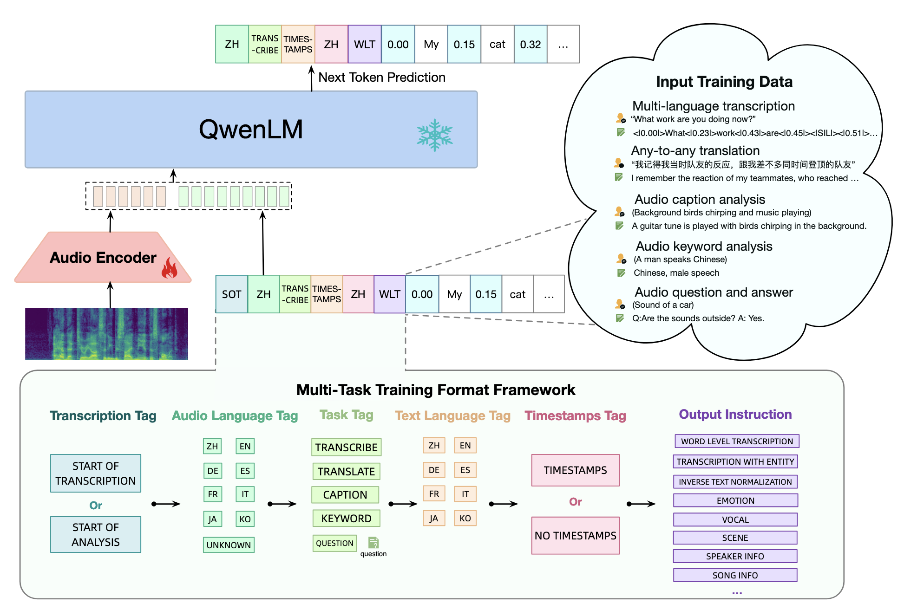

---

## [Qwen2.5-Audio.](https://arxiv.org/pdf/2311.07919)

### Training.

2 stages training:

1. **Multitask pretraining**:

    🔥 Audio Encoder. ❄️ LLM.

2. **SFT**:

    ❄️ Audio Encoder. 🔥 LLM.

---

## [Qwen2.5-Audio.](https://arxiv.org/pdf/2311.07919)
### Tasks.

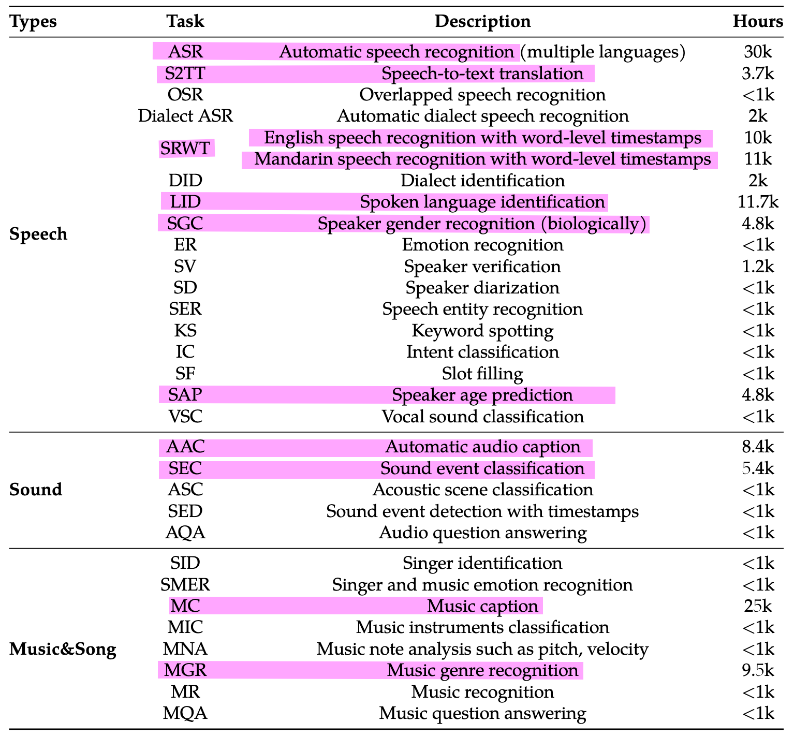

---

## [Qwen2.5-Audio.](https://arxiv.org/pdf/2311.07919)

### Results.

* ⚠️ No Text Modality Metrics were reported.

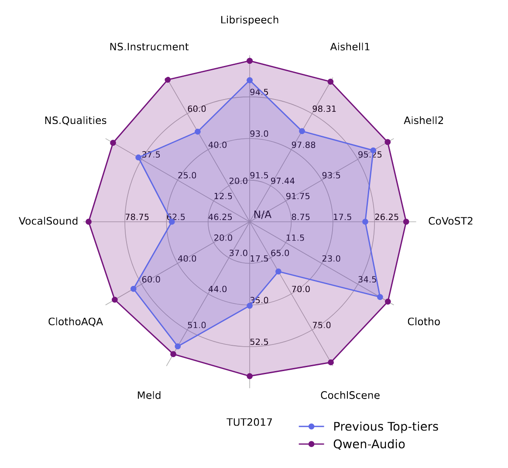

---

## Audio LLMs

* Qwen2.5-Audio
* Qwen2.5-Omni 👈
* Moshi

---

## [Qwen2.5-Omni.](https://arxiv.org/pdf/2503.20215)
### Architecture.

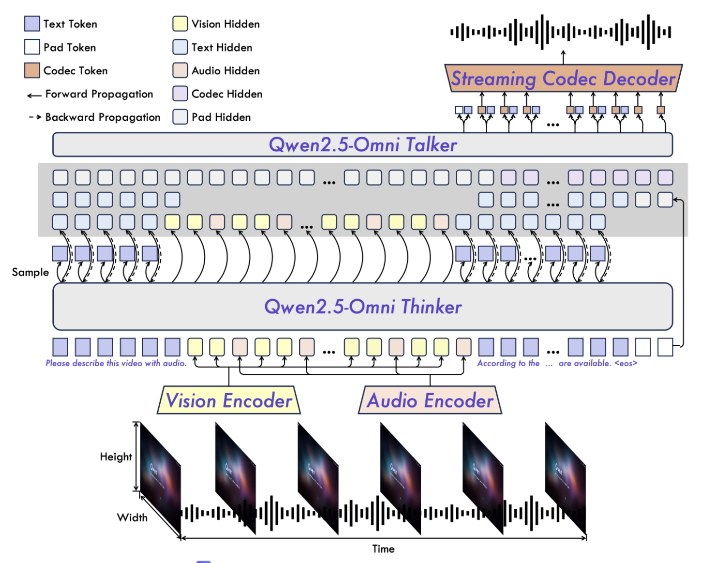

---

## [Qwen2.5-Omni.](https://arxiv.org/pdf/2503.20215)

### Thinker Training.

3 training stages:

1. **Encoders pretraining**:

    🔥 Audio Encoder. 🔥 Image Encoder. ❄️ LLM.

2. **Finetuning**:

    🔥 Audio Encoder. 🔥 Image Encoder. 🔥 LLM.

3. **Long Context Finetuning - 32k**:

    🔥 Audio Encoder. 🔥 Image Encoder. 🔥 LLM.

---

## [Qwen2.5-Omni.](https://arxiv.org/pdf/2503.20215)

### Talker Training.

3 training stages:

1. **Pretraining**:

    ❄️ Thinker. 🔥 Talker.

2. **DPO**:

    ❄️ Thinker. 🔥 Talker.

2. **SFT Instruciton-tuning**:

    ❄️ Thinker. 🔥 Talker.

---

## [Qwen2.5-Omni.](https://arxiv.org/pdf/2503.20215)

### Results.

Text Benchmarks.

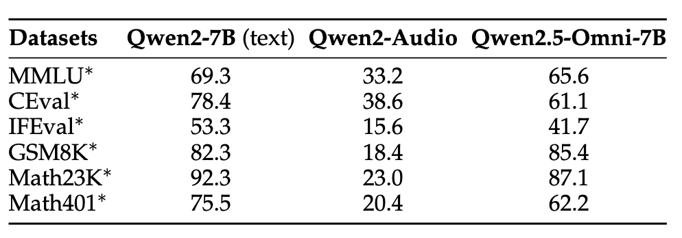

---

## [Qwen2.5-Omni.](https://arxiv.org/pdf/2503.20215)

### Results.

Audio Understanding Benchmarks.

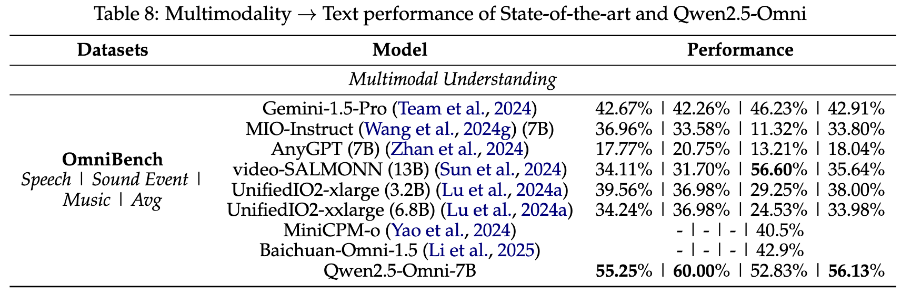

---

## [Qwen2.5-Omni.](https://arxiv.org/pdf/2503.20215)

### Results.

Zero-shot Speech Generation Benchmarks.

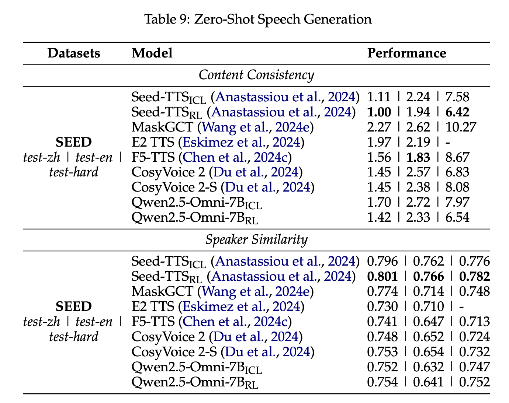

---

## [Qwen2.5-Omni.](https://arxiv.org/pdf/2503.20215)

### Questions.

* Qwen-TTS-Tokenizer ([**issue**](https://github.com/QwenLM/Qwen2.5-Omni/issues/219))❓
* Training Tasks and Data Details❓
* Why talker have to generate text tokens❓ What about tasks interference❓

---

## Audio LLMs

* Qwen2.5-Audio
* Qwen2.5-Omni
* Moshi 👈

---

## Simplex / Duplex / Half-duplex

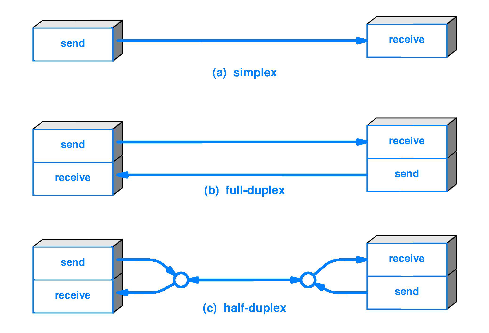

---

## [Moshi](https://arxiv.org/pdf/2410.00037)
### Architecture.

* Pretrained LLM: Helium-7B
* Full-duplex

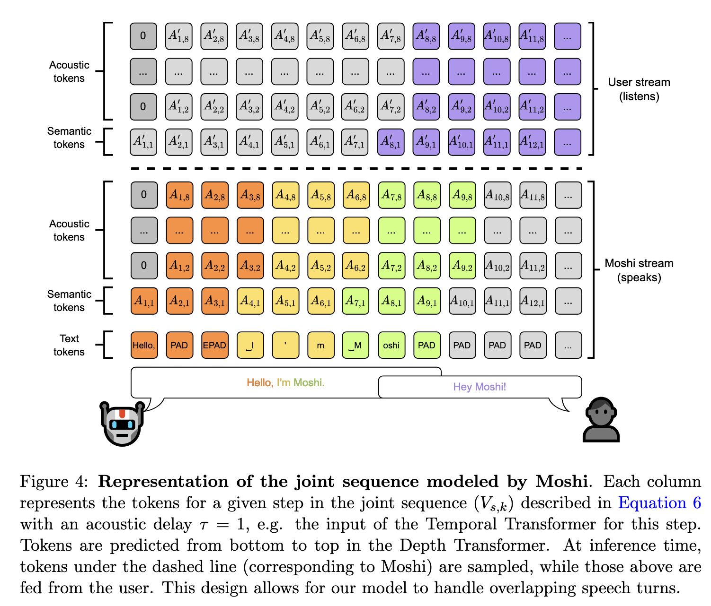

---

## [Moshi](https://arxiv.org/pdf/2410.00037)

### Training.

3 training stages:

1. 🎤 🗣️ 📚 Audio Pretraining

    Also text pretraing to prevent catastrophic forgetting
2. 🎤 🗣️ ↔️ 📚 Full-Duplex Training (Synth Data)
3. 🎤 🗣️ ↔️ 🧼 Clean Dialogue Dataset SFT

---

## [Moshi](https://arxiv.org/pdf/2410.00037)

### Evaluation.

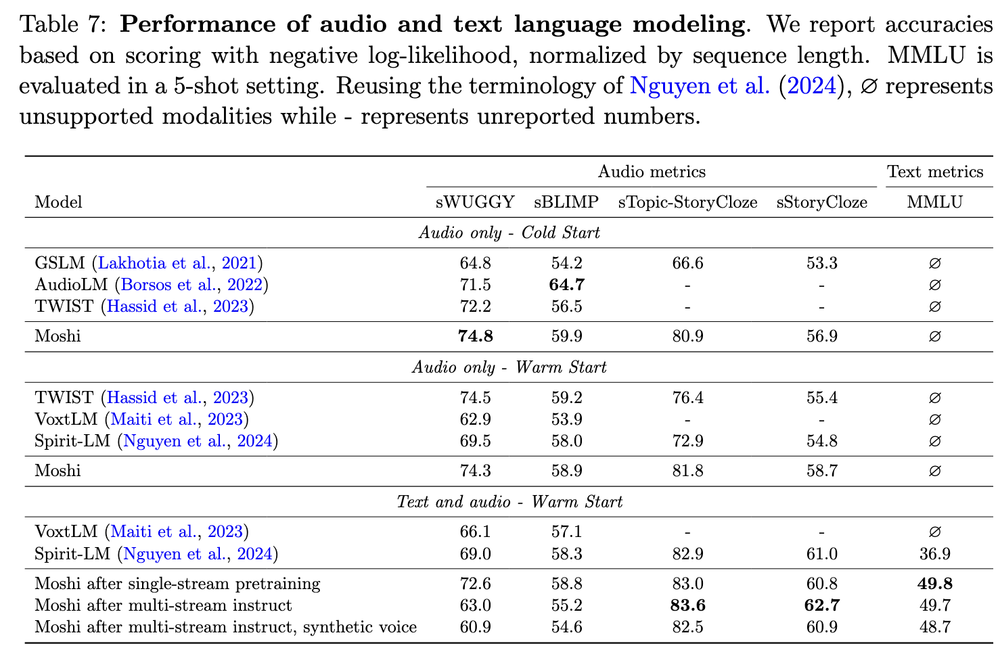

---

## Comparison

|  | **Qwen2.5-Audio**              | **Qwen2.5-Omni**              | **Moshi** (OpenAI)                      |
| ------------------- | ------------------------------ | ----------------------------- | --------------------------------------- |
| **Audio-In**  | ✅ | ✅ | ✅ |
| **Audio-Out** |    | ✅ | ✅ |
| **Image-In**  |    | ✅ |    |
| **Full-Duplex**  | | | ✅ |

---

## Materials

* Moshi overview SpeechInfo [\[1/2\]](https://t.me/speechinfo/36), [\[2/2\]](https://t.me/speechinfo/37)
* [**Sesame Conversational Voice**](https://www.sesame.com/research/crossing_the_uncanny_valley_of_voice)
* Audio Codecs (Mimi, )

