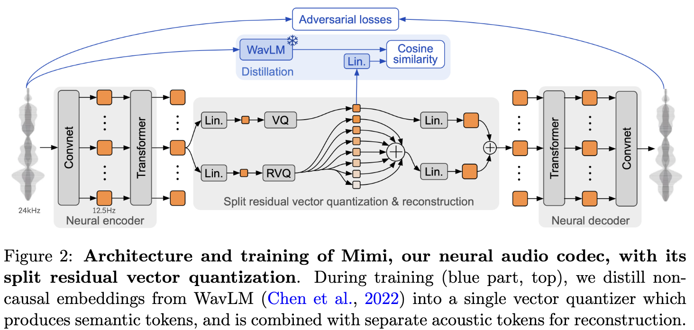

# Image

---

# Recap

* ViT
* CLIP
* ImageBind

---

## No LLM - Based
* Dalle
* Dalle2

---

# Approaches LLM-based / no-llm-based / Function calling

---

# Understanding

https://vkvideo.ru/playlist/-210514085_1/video-210514085_456239093

* Early Fusion / Deep Fusion / Late Fusion

Сравнение разных вериантов + примеры моделей , что в каком типе работает

---

### Модели:
* Formage
* BLIP2
* Llava
* Flamingo

---

## Generation / editing

# https://vkvideo.ru/playlist/-210514085_1/video-210514085_456239089

* GILL - https://github.com/kohjingyu/gill
* Mgie - https://github.com/apple/ml-mgie
* Bagel - https://github.com/ByteDance-Seed/Bagel (тут и понимание, и генерация есть)

---

# Audio Modality

---

## Audio Codecs

🎯 **Goal:**

Discrete Audio Representation for Causal Modeling (and/or audio compression)

---

## Audio Codecs

🤖 **Models:**
* Encodec (2022)
* Mimi (2024)

---

## [Encodec (2022)](https://arxiv.org/pdf/2210.13438)

### Architecture

* Varying Bitrates (Residual
Vector Quantization)

---

## [Encodec (2022)](https://arxiv.org/pdf/2210.13438)

### Loss

Reconstruction loss

---

## [Encodec (2022)](https://arxiv.org/pdf/2210.13438)

### Loss

Discriminative Loss

---

## [Encodec (2022)](https://arxiv.org/pdf/2210.13438)

### Loss

RVQ Commitment Loss

---

## [Encodec (2022)](https://arxiv.org/pdf/2210.13438)

### Loss

Balancer

---

## [Encodec (2022)](https://arxiv.org/pdf/2210.13438)

### Evaluation

---

## Audio Codecs

🤖 **Models:**
* ✅ Encodec (2022)
* Mimi (2024)

---

## [Mimi (2024)](https://arxiv.org/pdf/2410.00037)

### Architecture

* 🆕 Semantic Features Distillation

---

## [Mimi (2024)](https://arxiv.org/pdf/2410.00037)

### Metrics

---

## Audio Codecs

* ✅ Encodec
* ✅ Mimi

---

## Audio Codecs

| **Feature**                              | **Mimi**                         | **Encodec** (Meta)               |
| ---------------------------------------- | ----------------------------------------------------- | -------------------------------------------- |
| **Input audio sample rate**  | 16 kHz | 24,48 kHz |
| **Codec sample rate**        | 12.5 Hz | 150-2400 Hz |
| **Varying bandwidth** | ❌ | ✅ |
| **Semantic distillation** | ✅ | ❌ |

---

## Coversational LLMs

☑️ Audio Understanding

☑️ Audio Generation

☑️ Emotional

☑️ Interruptions handling

☑️ Instructions following (world model)

---

## Coversational LLMs

<iframe width="1120" height="630" src="https://www.youtube.com/embed/D9byh4MAsUQ?si=4bYXBCvFWT_c-7LD&amp;start=57" title="YouTube video player" frameborder="0" allow="accelerometer; autoplay; clipboard-write; encrypted-media; gyroscope; picture-in-picture; web-share" referrerpolicy="strict-origin-when-cross-origin" allowfullscreen></iframe>

---

## Audio LLMs

* Qwen2.5-Audio 👈
* Qwen2.5-Omni
* Moshi

---

## [Qwen2.5-Audio.](https://arxiv.org/pdf/2311.07919)
### Architecture.

* Whisper-Initialized Audio Encoder
* Qwen2.5-7B LLM Backbone

---

## [Qwen2.5-Audio.](https://arxiv.org/pdf/2311.07919)

### Training.

2 stages training:

1. **Multitask pretraining**:

    🔥 Audio Encoder. ❄️ LLM.

2. **SFT**:

    ❄️ Audio Encoder. 🔥 LLM.

---

## [Qwen2.5-Audio.](https://arxiv.org/pdf/2311.07919)
### Tasks.

---

## [Qwen2.5-Audio.](https://arxiv.org/pdf/2311.07919)

### Results.

* ⚠️ No Text Modality Metrics were reported.

---

## Audio LLMs

* Qwen2.5-Audio
* Qwen2.5-Omni 👈
* Moshi

---

## [Qwen2.5-Omni.](https://arxiv.org/pdf/2503.20215)
### Architecture.

---

## [Qwen2.5-Omni.](https://arxiv.org/pdf/2503.20215)

### Thinker Training.

3 training stages:

1. **Encoders pretraining**:

    🔥 Audio Encoder. 🔥 Image Encoder. ❄️ LLM.

2. **Finetuning**:

    🔥 Audio Encoder. 🔥 Image Encoder. 🔥 LLM.

3. **Long Context Finetuning - 32k**:

    🔥 Audio Encoder. 🔥 Image Encoder. 🔥 LLM.

---

## [Qwen2.5-Omni.](https://arxiv.org/pdf/2503.20215)

### Talker Training.

3 training stages:

1. **Pretraining**:

    ❄️ Thinker. 🔥 Talker.

2. **DPO**:

    ❄️ Thinker. 🔥 Talker.

2. **SFT Instruciton-tuning**:

    ❄️ Thinker. 🔥 Talker.

---

## [Qwen2.5-Omni.](https://arxiv.org/pdf/2503.20215)

### Results.

Text Benchmarks.

---

## [Qwen2.5-Omni.](https://arxiv.org/pdf/2503.20215)

### Results.

Audio Understanding Benchmarks.

---

## [Qwen2.5-Omni.](https://arxiv.org/pdf/2503.20215)

### Results.

Zero-shot Speech Generation Benchmarks.

---

## [Qwen2.5-Omni.](https://arxiv.org/pdf/2503.20215)

### Questions.

* Qwen-TTS-Tokenizer ([**issue**](https://github.com/QwenLM/Qwen2.5-Omni/issues/219))❓
* Training Tasks and Data Details❓
* Why talker have to generate text tokens❓ What about tasks interference❓

---

## Audio LLMs

* Qwen2.5-Audio
* Qwen2.5-Omni
* Moshi 👈

---

## Simplex / Duplex / Half-duplex

---

## [Moshi](https://arxiv.org/pdf/2410.00037)
### Architecture.

* Pretrained LLM: Helium-7B
* Full-duplex

---

## [Moshi](https://arxiv.org/pdf/2410.00037)

### Training.

3 training stages:

1. 🎤 🗣️ 📚 Audio Pretraining

    Also text pretraing to prevent catastrophic forgetting
2. 🎤 🗣️ ↔️ 📚 Full-Duplex Training (Synth Data)
3. 🎤 🗣️ ↔️ 🧼 Clean Dialogue Dataset SFT

---

## [Moshi](https://arxiv.org/pdf/2410.00037)

### Evaluation.

---

## Comparison

|  | **Qwen2.5-Audio**              | **Qwen2.5-Omni**              | **Moshi** (OpenAI)                      |
| ------------------- | ------------------------------ | ----------------------------- | --------------------------------------- |
| **Audio-In**  | ✅ | ✅ | ✅ |
| **Audio-Out** |    | ✅ | ✅ |
| **Image-In**  |    | ✅ |    |
| **Full-Duplex**  | | | ✅ |

---

## Materials

* Moshi overview SpeechInfo [\[1/2\]](https://t.me/speechinfo/36), [\[2/2\]](https://t.me/speechinfo/37)
* [**Sesame Conversational Voice**](https://www.sesame.com/research/crossing_the_uncanny_valley_of_voice)
* Audio Codecs (Mimi, )

